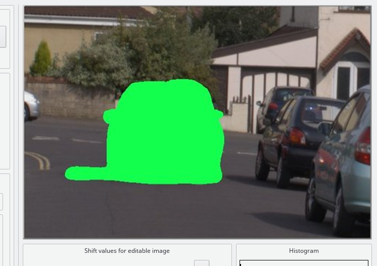

Using Editing Tools
===================

Within Editing Tools it is possible to do some manual editing activities before performing the hdr merge.

.. figure:: /images/editingtools-1.png

Using the arrow buttons shown in the bottom right part of the window you can shift the editable image to better align it.
Press shift to shift the image by 10 pixels, control to shift by 50 pixels and :kbd:`shift-control` to shift by 100 pixels.
Use the visualization mode combo box on the upper left of the window to help you with the alignment.
The best mode for aligning the images is Difference (E-P) where the difference between the editable and reference images is shown.
After aligning the images you can crop them drawing a selection box and clicking on the crop button.
Then you can save them for future use, all the relevant EXIF data will be saved as well.
Now, if needed, you can proceed removing the ghosting artefacts resulting from moving objects in the scene.
You have two options: manual and auto anti-ghosting. The auto anti-ghosting is pretty straightforward,
just click on the Auto anti-ghosting check box and select a threshold value.
Clicking on the Recompute button a series of patches is computed and visualized
so that you can actually see how well the "ghost" it will be removed.
The patches must cover all the affected "ghosting area" but, especially with misaligned images,
it is possible that some patches will cover even anaffected areas.
If this happens you can increase the threshold and recompute the patches
again or you can manually add or remove patches just clicking on the image
on the position you want a patch to be removed or added (clicking on a patch will remove it).
Once you are done you can click next to close Editing Tools and continue with HDR merging.

.. figure:: /images/editingtools-2.png

If you prefer it is possible to manually draw a mask over the "ghost" using a lasso or a brush.
To access the manual anti-ghosting feature click on the Anti-ghosting button.
New options to work with the mask will then appear, you can chose the size of the brush,
the mask strength (draw the mask semi-transparent), if to add or remove the mask while drawing.
You can also save a previously created mask and apply it again to another image.
You now must select the good image from the list, the good image
is the one that will be left unchanged after ghost removal.
Keep in mind that you must draw a mask even on the good image.
Basically all the pixels that change in all images must be covered by a mask.
The Difference (E-P) visualization mode will help you discovering the ghost affected areas of the scene.
The image below shows and example of a mask covering just a part of the ghost.

Example
=======

   Example of anti-ghosting mask

.. figure:: /images/editingtools-5.png

   Final HDR without ghost removal

.. figure:: /images/editingtools-6.png

   Final HDR after performing manual anti-ghosting
